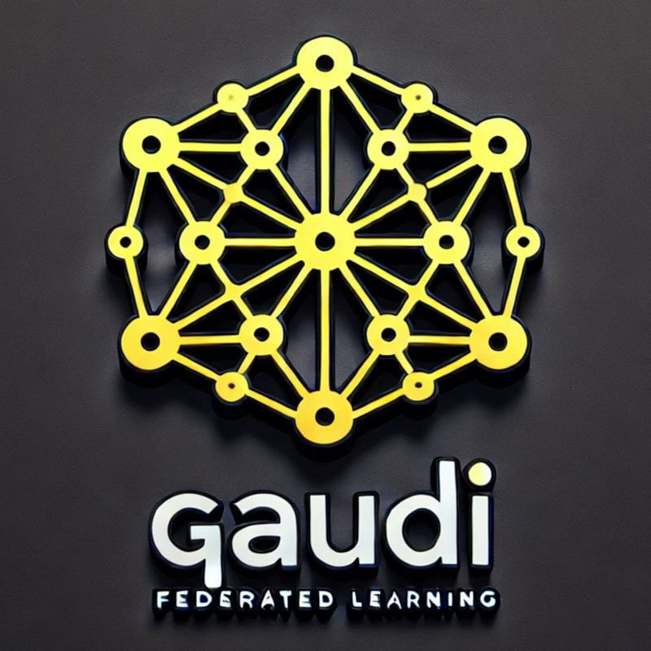

<div align="center">
	
	<br/>
	<h1>Gaudi-FLAME</h1>
	<br/>
	<a href="https://www.python.org/"></a>
</div>


# Gaudi Suite for Federated Learning with Message Efficiency (FLAME)

Federated learning is a machine learning approach where many clients collaboratively train a model under the orchestration of a central server while keeping the training data decentralized. This helps address data privacy concerns and enables lower-latency inference. However, the communication cost can be prohibitively high, especially for clients with slow or expensive communication links.

This repository implements communication-efficient federated learning algorithms in PyTorch, supporting Gaudi HPU.

## Supported Algorithms and Tasks
The suite includes the following algorithms:
- [x] **[FedAvg](https://arxiv.org/abs/1602.05629)**: Baseline Federated Averaging.
- [x] **[Subsampling](https://arxiv.org/pdf/1610.05492)**: Federated Averaging with Subsampling.
- [x] **[Quantization](https://arxiv.org/abs/1710.05492)**: Federated Averaging with Quantization.
- [ ] **[EvoFed](https://arxiv.org/abs/2003.00295)**: Evolutionary Federated Learning.
- [ ] **[MAPA]()**: Model-Agnostic Projection Adaptation.
- [ ] **[FA-LoRA](https://arxiv.org/abs/2403.13269)**: Frozen-A Low-Rank Adaptation.
- [ ] **[MA-LoRA]()**: Model-Agnostic Low-Rank Adaptation.

And Benchmarked on:
- [x] **[MNIST](http://yann.lecun.com/exdb/mnist/)**: A dataset of handwritten digits (0-9) commonly used for image classification tasks.
- [x] **[Fashion-MNIST (FMNIST)](https://github.com/zalandoresearch/fashion-mnist)**: A dataset of Zalando's article images used for image classification tasks.
- [x] **[CIFAR-10/100](https://www.cs.toronto.edu/~kriz/cifar.html)**: Datasets containing 10 or 100 classes of 32x32 color images, widely used for image recognition tasks.
- [ ] **[Shakespeare Dataset](https://leaf.cmu.edu/)**: A character-level dataset built from Shakespeare’s plays, used for next-character prediction tasks.
- [ ] **[Sentiment140](https://www.kaggle.com/datasets/kazanova/sentiment140)**: A dataset for sentiment analysis containing 1.6 million tweets labeled as positive, negative, or neutral.
- [ ] **[Reddit Dataset](https://leaf.cmu.edu/)**: A dataset of user comments from Reddit structured for federated learning tasks like next-word prediction or topic modeling.


The suite is modular and extensible, allowing easy integration of new algorithms and datasets.

---

## Environment Setup

### For CUDA on the Host

Set up the environment using `conda`:
```bash
conda create -n fl python=3.12
conda activate fl
conda install pytorch torchvision torchaudio cudatoolkit=10.2 -c pytorch
pip install -r requirements.txt
```

Run experiments:
```bash
# Run the training script on GPU
python train.py

# Run the training script on CPU
python train.py --gpu -1
```

---

### For Gaudi v2 on Docker

#### 1. Gaudi Docker Preparation
To install PyTorch on Gaudi-v2, use Intel Habana's setup:
- Follow the [Installation Guide](https://docs.habana.ai/en/latest/Installation_Guide/index.html#gaudi-installation-guide).
- Supported PyTorch versions are listed in the [Support Matrix](https://docs.habana.ai/en/latest/Support_Matrix/Support_Matrix.html#support-matrix).

Example installation for PyTorch 2.4.0 on Ubuntu 22.04:
```bash
export OS="ubuntu22.04"
export PTV="2.4.0"
docker pull vault.habana.ai/gaudi-docker/1.18.0/${OS}/habanalabs/pytorch-installer-${PTV}:latest
docker run --name torch${PTV} -it --runtime=habana \
  -e HABANA_VISIBLE_DEVICES=all \
  -e OMPI_MCA_btl_vader_single_copy_mechanism=none \
  --cap-add=sys_nice --net=host --ipc=host \
  -v /home/irteamsu/data:/data \
  vault.habana.ai/gaudi-docker/1.18.0/$OS/habanalabs/pytorch-installer-${PTV}:latest
```

For more details, see [Getting Started with PyTorch and Gaudi](https://docs.habana.ai/en/latest/PyTorch/Getting_Started_with_PyTorch_and_Gaudi/Getting_Started_with_PyTorch.html).

#### 2. Project Setup
```bash
# Set up environment variables
export WANDB_API_KEY=<your_wandb_api_key>
export WANDB_MODE="online"
export PT_HPU_LAZY_MODE=0  # Eager mode

# Build the Docker image
./docker_build_run.sh <image_name> Dockerfile . ./data
```

Run the code:
```bash
# Run training on Gaudi
./docker_run.sh python train.py --gaudi

# Run training on Gaudi in eager mode
PT_HPU_LAZY_MODE=0 ./docker_run.sh python train.py --gaudi --eager

# Run training on CPU
./docker_run.sh python train.py --gpu -1
```

---

## Project Structure

```
project/
├── Dockerfile           # Defines the container environment and dependencies.
├── setup_env.sh         # Custom environment setup script for the container. Executed in Dockerfile.
├── requirements.txt     # Python dependencies for the project. Installed with Dockerfile.
├── docker_build_run.sh  # Builds and optionally runs a Docker container.
├── docker_run.sh        # Runs a pre-built Docker container with mounts and script execution.
```
---

## Usage

### Build and Run Docker Image
```bash
./docker_build_run.sh <image_name> <dockerfile_path> [source_folder] [dataset_folder] [script_to_run] [script_args...]
```
Example:
```bash
./docker_build_run.sh my_image ./Dockerfile ./src ./data ./train.py arg1 arg2
```

### Run a Pre-Built Docker Image
```bash
./docker_run.sh <image_name> [source_folder] [dataset_folder] [script_to_run] [script_args...]
```
Example:
```bash
./docker_run.sh my_image ./src ./data ./train.py arg1 arg2
```

### Interactive Mode
```bash
./docker_run.sh my_image ./src ./data
```

---

## Training Example

Run training with specific arguments:
```bash
python train.py --dataset mnist --iid --model cnn --epochs 50 --gaudi --all_clients
```
See the arguments in [config.py](utils/config.py). 

---

## Environment Variables

- **`WANDB_API_KEY`**: API key for Weights and Biases logging.
- **`WANDB_MODE`**: Logging mode (`online` or `offline`).
- **`PT_HPU_LAZY_MODE`**: Controls Habana lazy execution mode (default: `1`).

---

## Results
TBD

---

## Acknowledgements
TBD

---

## References
This repository draws inspiration from:
- [shaoxiongji/federated-learning](https://github.com/shaoxiongji/federated-learning)
- [mahi97/EvoFL](https://github.com/mahi97/EvoFL)
- [AshwinRJ/Federated-Learning-PyTorch](https://github.com/AshwinRJ/Federated-Learning-PyTorch)
- [lokinko/Federated-Learning](https://github.com/lokinko/Federated-Learning)
- [research/federated](https://github.com/google-research/federated)
- [rui-ye/OpenFedLLM](https://github.com/rui-ye/OpenFedLLM)
- [innovation-cat/Awesome-Federated-Machine-Learning](https://github.com/innovation-cat/Awesome-Federated-Machine-Learning)
